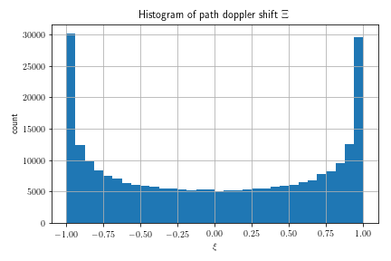
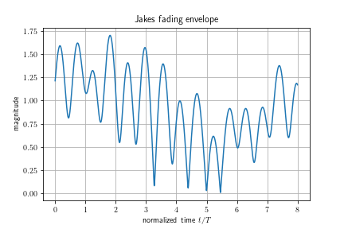
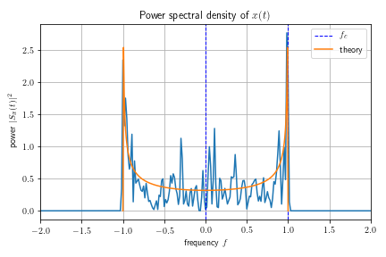

# Contents
- jakes.py
  - implementation of Jakes fading model (from Haykin 6th Ed.)
  - requires numpy, scipy, matplotlib
  - modifies global variables
- notebook.ipynb
  - notebook used to produce figures
  - uses global variables modified by jakes.py

# Distribution of Doppler shifts

# Fading Envelope

# Doppler Power Spectrum
Still working on scaling and centering spectrum properly.

